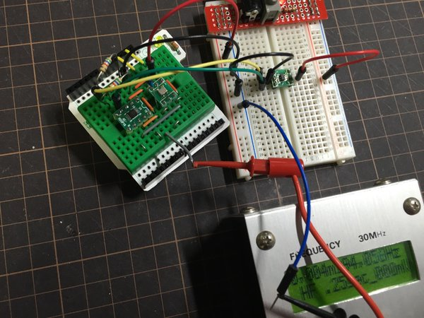

# SI5351A setup controller for Attiny10

This project is to build a small clock generator based on Si5351A.

ATtiny10 is used to setup Si5351A. All parameters are defined at compile time. No calculation are required at execution time.
Less than 700bytes of flash memory is used.

Note: you need to supply parameters for your frequency plan. 
I recomend to use Silicon Lab's official application to find a set of best paratemeters. 

